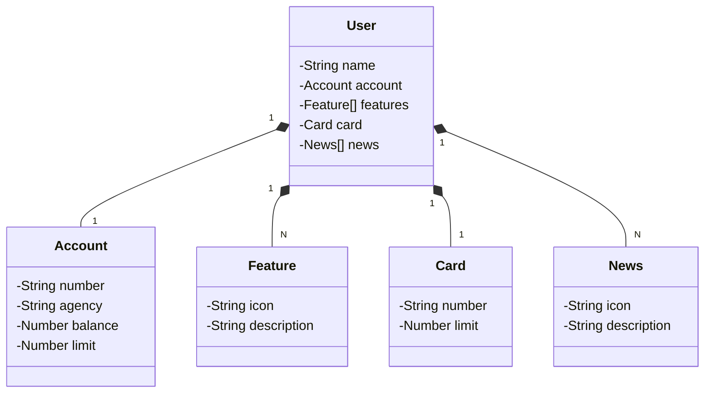

# Santander dev week - Decola Tech 2025

Java RESTful API criada para a Santander Dev Week.

## Instalação
Como pré-requisito, você precisa ter: 
- Java versão 17
- Spring Boot versão 3.1.2 

## Outras tecnologias utilizadas
Spring Data, Swagger e Railway. 

## Diagrama de classes (Domínio da API)

